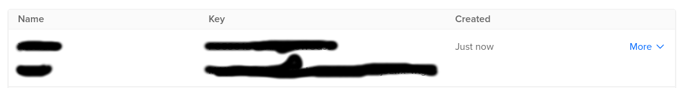

# copyspace
copyspace é uma ferramenta que copia arquivos para os Buckets da DigitalOcean chamados de Spaces

## Troubleshooting

### Erro em montar as credenciais

Em **manage > API > spaces access keys> Generate New Key** deve gerar uma key como o nome que *desejar* e um token chamado *Secret*. Caso tenha símbolos ou caracteres que não são aceitos para key ou traga alguma *mensagem* de erro. É recomendado a criação de uma nova key até o resultado ser igual a foto abaixo.
