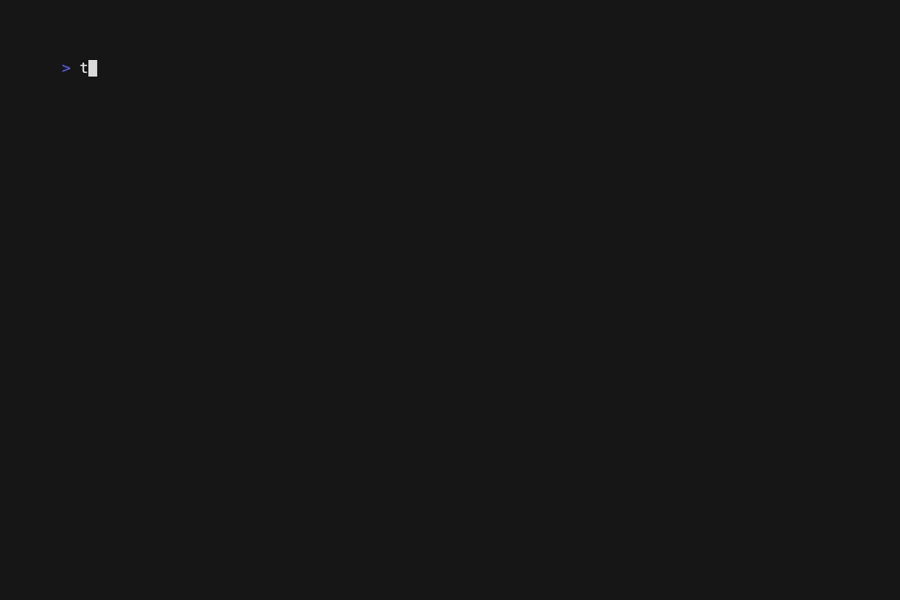

# Copyspace 🚀

Copyspace is a powerful and efficient CLI tool for concurrently copying files and directories to DigitalOcean Spaces and AWS S3-compatible buckets. Written in Go, it uses goroutines to maximize transfer speeds and supports multiple concurrent workers. Ideal for backups, migrations, and synchronization in multi-cloud environments.

# copyspace in action 💕🐧🚀



## 🌟 Main features

• Concurrent upload and download of files and directories
• Full support for DigitalOcean Spaces and AWS S3
• Dynamic configuration of bucket, endpoint and permissions (ACL)
• Automatic detection of the file MIME type
• Advanced error management and colored logs for better visualization
• Control of the number of workers for performance optimization
• Recursive download maintaining the structure of local directories
• Use of contexts for cancellation and synchronization of processes

#### Install

You can install Copyspace easily on any Linux or Mac system by running:

```bash
sh -c "$(wget https://raw.githubusercontent.com/jeffotoni/copyspace/refs/heads/master/v1/install.sh -O -)"
```

### **After installation, make sure `/usr/local/bin` is in your PATH:**

### 1. Check if /usr/local/bin is in your PATH
```bash
echo $PATH
```

If /usr/local/bin is missing, add it to your shell configuration file:
 - For Zsh users, add this line to your ~/.zshrc:

```bash
export PATH="/usr/local/bin:$PATH"
```

For Bash users, add this line to your ~/.bashrc:
```bash
export PATH="/usr/local/bin:$PATH"
```

Then reload your shell (replace with your shell as appropriate):
```bash
source ~/.zshrc
# or
source ~/.bashrc
```

### 2. Verify your installation
```bash
which copyspace
```

It should print something like:
```bash
/usr/local/bin/copyspace
```

Check which copyspace binary is found first in your PATH:

Now, you can run:
```bash
copyspace -h
```

If you still have issues, check for duplicate or conflicting binaries in other directories (e.g., /usr/bin).
Adjust your PATH order if needed to prioritize /usr/local/bin.

#### Credenciais

You will need to create a hidden file in your home, .dokeys which needs to contain your credentials.

#### 🛠️ How to run
1. Set up the credentials file (.dokeys) in your home directory.
2. Run the desired command as per the examples above.
3. Monitor the colored log to track progress and errors

```bash
{
    "key":"xxxxxxxxxxxx",
    "secret":"xxxxxxxxxx",
    "endpoint":"https://sfo2.digitaloceanspaces.com",
    "region":"us-east-1",
    "bucket":"your-bucket"
}
```
## 🛠️ Building Binaries for Multiple Platforms

You can easily build platform-specific binaries using the provided Makefile:

```bash
# Build all binaries (Mac ARM, Mac Intel, Linux AMD64, Linux 386)
make

# Build only for your current platform (e.g., Mac ARM64)
make mac-arm64

# Clean up all generated binaries
make clean
```
Binaries generated:

    • copyspace-mac-arm64
    • copyspace-mac-amd64
    • copyspace-linux-amd64
    • copyspace-linux-386
    • copyspace-windows-amd64.exe
    • copyspace-windows-386.exe

## 🛠️ Commands copyspace

Upload a single file to the bucket
```bash
copyspace -file /path/to/file.txt -bucket bucket-name
```

Upload an entire directory recursively with 100 concurrent workers
```bash
copyspace -file /path/to/directory -bucket bucket-name -worker 100
```

Set public permission for the uploaded files
```bash
copyspace -file /path/to/file.txt -bucket bucket-name -acl public
```

Enable recursive download mode from a bucket to a local directory
```bash
copyspace -cp -bucket bucket-name -out /path/to/destination
```
Show help with all available options
```bash
copyspace -h
```